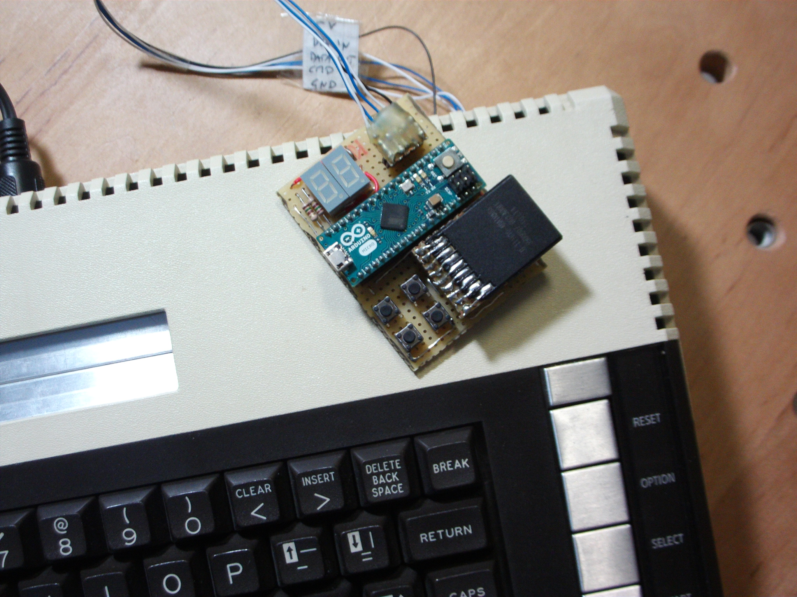
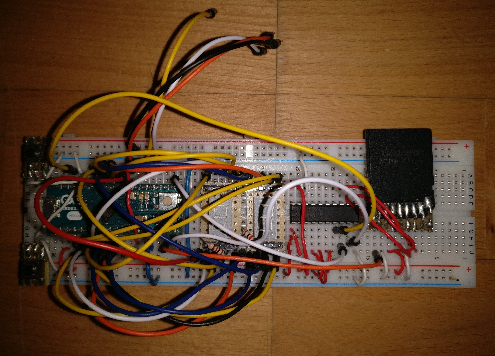
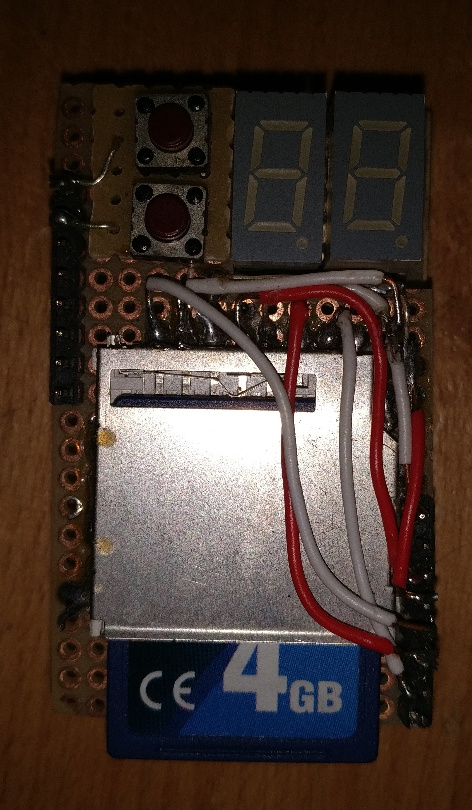

# SIO2SD
An Arduino-based floppy drive emulator for the Atari 8 bit computers.

This small Arduino build emulates an Atari 1050 floppy drive to connect
to an original Atari 8-bit computer. The program is compatible with
most Arduino boards. And for boards based on the Atmega32u4 it also provides
various log messages on the serial monitor to help debugging (mainly for my own use).

For a breadboard setup like my development device, you will need two push buttons,
two 7-digit LEDs and one SDCard socket (with built-in or separate level shifters) and
some wires and resistors. The connectivity is pretty standard and you will find
the details as comments in the source code.

## Emulated floppies on SDcard
The floppy drive emulator needs an SDcard containing .ats files for each individual floppy disk.
Because there is no elaborated user-interface on the device, the naming and location of the files
need to follow a fixed system: The files are searched for in a directory ATARI/
on the root of the SDcard. Every disk file must be named nn_Anything.ats with two leading digits that correspond to the
numeric display on the device and the mandatory '_' character. Alternatively you can also
have a folder named nn_Anything with individual files inside. Such a folder will be emulated
as an read-only enhanced density floppy containing these files.

Currently only a very basic support for single density (720 sectors)
and enhanced density (1040 sectors) floppies is provided without special functions for any third-party devices.

## User interface
You can switch though the numbered disks 00 to 99 with the two buttons. This is the maximum number of disks 
supported on a single SDcard. When you switch beyond 99, you will see -- on the display, which means the device
now emulates a switched off floppy drive. Selecting a number for which no diskfile exists will simulate 
a device with no floppy inserted (in this case you can create a diskfile with the DOS format functions).

You can also emulate a second floppy drive, which is very usable for example for holding the save disks
for games that support this. To do so, you need to press both buttons to make the small indicator dot appear
on the left LCD block. This means that the number you see in the display is the floppy that is inserted
in drive 2. This floppy can now also be changed with the two buttons. It is even possible to select the same 
floppy in both drives at once (but this is probably of no great use).

## Hardware Variants

* First prototype with Arduino Micro. 
This was hand-wired. No longer supported by the firmware.

* Breadboard setup with Arduino Micro.
Because the MCU is running with 5V, I need level shifters to interface with the SDCard. This setup directly drives the 
Data-In line of the Atari without considering a multiple-slave configuration. This could be corrected with a simple schottky diode.
To keep the part count down, this setup only uses a single resistor per LED digit which causes varying brightness of the display segments.

* Bare bone ATmega328 (DIP package).
Designed to fit into a small form factor by using a home-etched two board design.
The MCU is running at 8MHz on 3.3V and can talk to SDCard without level shifters. The logic level difference between Atari and 
the MCU causes the incoming SIO high levels to be pulled down to about 3.9V by the internal clamp diodes. This only creates 
a small current (0.2mA) and should be OK as long as these lines are only driven by the pull-up resistors of the Atari.
The LEDs have resistors on the digit select lines only, therefore the brightness varies with the pattern.

