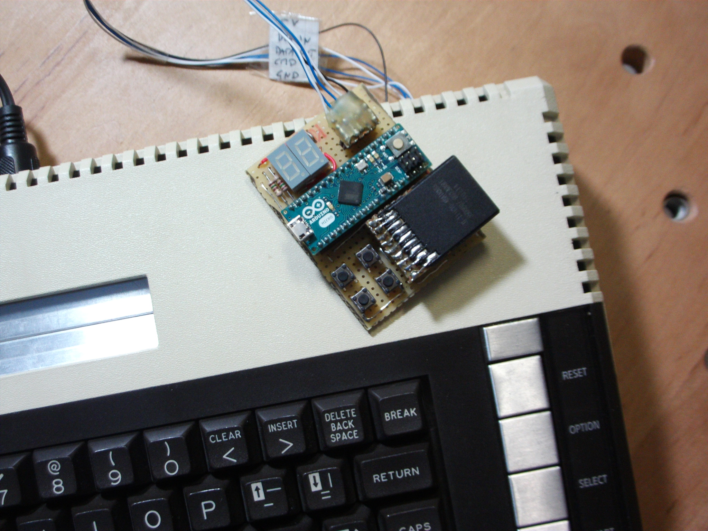
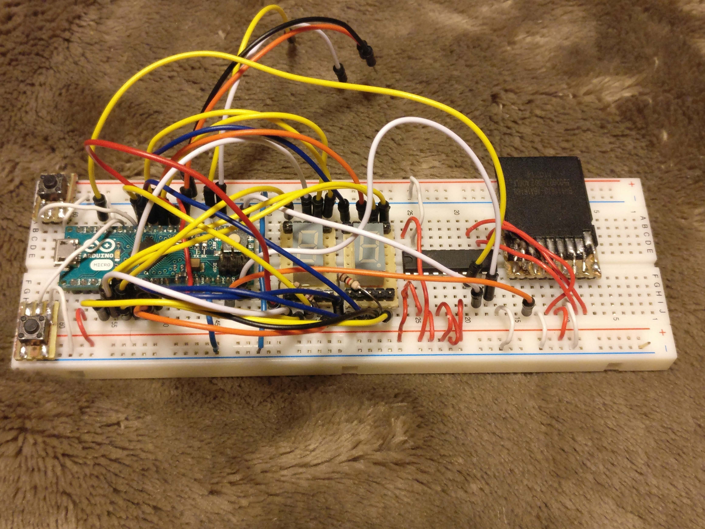
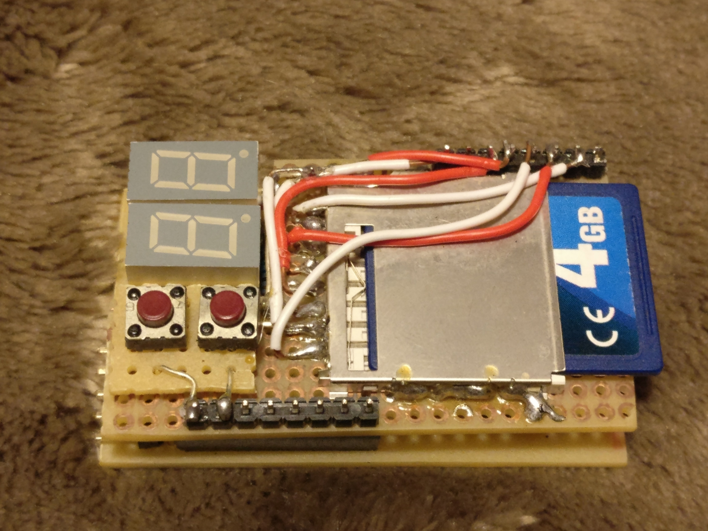

# Prototype hardware variants

* First prototype with Arduino Micro. 
This was hand-wired. No longer supported by the firmware.

* Breadboard setup with Arduino Micro.
Because the MCU is running with 5V, I need level shifters to interface with the SDCard. This setup directly drives the 
Data-In line of the Atari without considering a multiple-slave configuration. This could be corrected with a simple schottky diode.
To keep the part count down, this setup only uses a single resistor per LED digit which causes varying brightness of the display segments.

* Bare bone ATmega328 (DIP package).
Designed to fit into a small form factor by using a home-etched two board design.
The MCU is running at 8MHz on 3.3V and can talk to SDCard without level shifters. The logic level difference between Atari and 
the MCU causes the incoming SIO high levels to be pulled down to about 3.9V by the internal clamp diodes. This only creates 
a small current (0.2mA) and should be OK as long as these lines are only driven by the pull-up resistors of the Atari.
The LEDs have resistors on the digit select lines only, therefore the brightness varies with the pattern.

